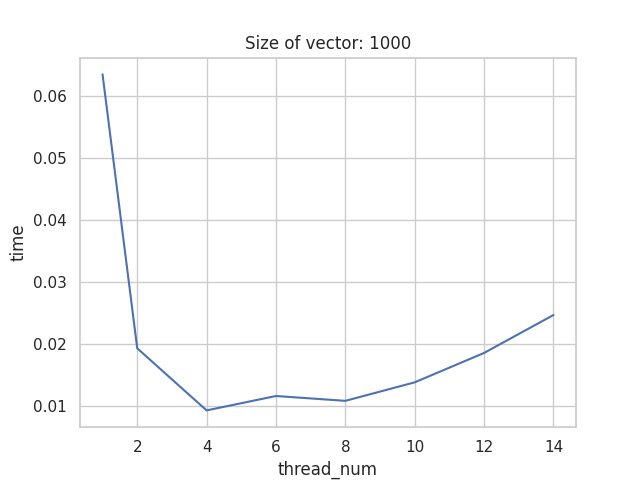

# Laboratório de Paralelismo 

## Compilação e Execução

Dentro da pasta Lab01, abra o terminal e execute o seguinte comando

``
python3 paralelismo.py num_threads vetor

`

Onde `num_threads` é o número de threads nas quais serão divididas o vetor, e `vetor` é a sequencia de todos os números do vetor, separados por espaço

Por exemplo:
    
    ````


python3 ordenacao.py 4 10 8 7 6 5 4 3 2 1 9
    ````


Isso irá ordenar o vetor `[10, 8, 7, 6, 5, 4, 3, 2, 1, 9]` usando `quatro` threads.

---

## Bibliotecas Utilizadas

As seguintes bibliotecas são utilizadas no script:

`multiprocessing`: fornece suporte para criação de processos. Usamos sua função `Pipe()` para criar um canal de comunição entre processo pai e filho, para que o processo filho envie o vetor ordenado ao pai. Usamos sua função `Process(target, args)` para criar um processo, enviando como parâmetro a assinatura da função que será paralelizada e os argumentos que a função irá utilizar.

`sys`: fornece acesso a algumas variáveis usadas ou mantidas pelo interpretador e a funções que interagem fortemente com o interpretador. A usamos para receber por parâmetro os valores do número de threads e o vetor.

---

## Funções 

* **`merge`**: 

irá mesclar dois vetores em um único vetor. A função recebe uma conexão com o processo filho e os dois vetores a serem unidos como entrada e compara cada posição dos vetores, organizando-os ordenadamente no vetor resultante e, após isso, envia o vetor para o processo pai pela conexão criada pela `Pipe()` e encerra o processo filho usando a função `.close()`.

Esse procedimento é feito em complexidade `O(n)`, sendo `n` o `número total de elementos em ambos vetores de entrada`, uma vez que nenhuma função de ordenação é chamada pra ordenar o vetor resultante e a função irá percorrer cada elemento dos vetores de entrada exatamente uma vez. Assim, o número de iterações necessárias é diretamente proporcional ao número total de elementos nos vetores de entrada, e o vetor resultante terá também `n` elementos.


* **`bubble_sort`**: 

Irá ordenar um vetor em ordem crescente. A função recebe uma conexão com o processo filho e um vetor como entrada e ordena o vetor usando o algoritmo bubble sort. Em seguida, a função envia o vetor ordenado para o processo pai por meio da cpnexão criada pela `Pipe()` e encerra o processo filho usando a função `.close()`.

---

## Função Principal

A função principal recebe dois argumentos da linha de comando: o número de threads a ser usado e o vetor a ser ordenado. O vetor é dividido em subvetores e cada subvetor é ordenado usando o algoritmo bubble sort em um processo separado. Os subvetores ordenados são então mesclados usando o algoritmo merge até que um único vetor ordenado seja obtido. O vetor final ordenado é impresso no console.

A função principal usa o módulo multiprocessing para criar processos e a classe Pipe para criar um pipe entre os processos pai e filho para comunicação. O método start é usado para iniciar os processos e o método join é usado para aguardar a conclusão dos processos.


# Resultados 

## Resultados com computador de 36 núcleos, 72 threads

Abaixo estão os resultados obtidos ao executar o programa com diferentes números de threads e diferentes tamanhos de vetor. 

### Vetor de tamanho 14 
| Número de Threads | Tempo de Execução |
|:-----------------:|:-----------------:|
| 1 | 0.007s |
| 2 | 0.007s |
| 4 | 0.013s |
| 6 | 0.019s |
| 8 | 0.022s |
| 10 |0.028s |
| 12 | 0.032s |
| 14 | 0.022s |


### Vetor de tamanho 100
| Número de Threads | Tempo de Execução |
|:-----------------:|:-----------------:|
| 1 | 0.005s |
| 2 | 0.007s |
| 4 | 0.013s |
| 6 | 0.017s |
| 8 | 0.021s |
| 10 |0.029s |
| 12 | 0.033s |
| 14 | 0.029s |


### Vetor de tamanho 1000
| Número de Threads | Tempo de Execução |
|:-----------------:|:-----------------:|
| 1 | 0.095s |
| 2 | 0.048s |
| 4 | 0.029s |
| 6 | 0.028s |
| 8 | 0.029s |
| 10 |0.032s |
| 12 | 0.038s |
| 14 | 0.034s |


### Vetor de tamanho 10000

| Número de Threads | Tempo de Execução |
|:-----------------:|:-----------------:|
| 1 | 8.867s |
| 2 | 2.266s |
| 4 | 0.599s |
| 6 | 0.303s |
| 8 | 0.196s |
| 10 |0.172s |
| 12 | 0.113s |
| 14 | 0.101s |


## Resultados com computador com somente 6 núcleos, 12 threads


### Vetor de tamanho 14

| Número de Threads | Tempo de Execução |
|:-----------------:|:-----------------:|
| 1 | 0.007s |
| 2 | 0.002s |
| 4 | 0.004s |
| 6 | 0.007s |
| 8 | 0.009s |
| 10 |0.011s |
| 12 | 0.013s |
| 14 | 0.014s |

### Vetor de tamanho 100


| Número de Threads | Tempo de Execução |
|:-----------------:|:-----------------:|
| 1 | 0.0020s |
| 2 | 0.0035s |
| 4 | 0.0035s |
| 6 | 0.00767s |
| 8 | 0.0089s |
| 10 | 0.0115s |
| 12 | 0.0121s |
| 14 | 0.0139s |

### Vetor de tamanho 1000

| Número de Threads | Tempo de Execução |
|:-----------------:|:-----------------:|
| 1 | 0.063401s |
| 2 |0.01929s |
| 4 | 0.00929s |
| 6 | 0.01161s |
| 8 | 0.010831s |
| 10 | 0.01381s |
| 12 | 0.01854s |
| 14 | 0.024655s |

### Vetor de tamanho 10000

| Número de Threads | Tempo de Execução |
|:-----------------:|:-----------------:|
| 1 | 6.47178s |
| 2 |1.89784s |
| 4 | 0.47987s |
| 6 | 0.258738s |
| 8 | 0.17149s |
| 10 | 0.129956s |
| 12 | 0.102327s |
| 14 | 0.117027s |


# gráfico de desempenho para computador com 36 núcleos, 72 threads


#gŕafico de desempenho para computador com 6 núcleos, 12 threads





# Conclusão
g
O programa foi implementado usando o módulo multiprocessing do Python. O programa foi testado em um computador com 36 núcleos e 72 threads e em um computador com 6 núcleos e 12 threads. Os resultados mostram que, até um certo ponto, é vantajoso em questão de tempo dividir o processamento em mais núcleos. No entanto, a partir de um certo ponto, o tempo de execução começa a aumentar. Isso ocorre porque o tempo de comunicação entre os processos também aumenta, o que pode ser visto no gráfico de desempenho para o aumento do núemro de threads.

Também é possível dizer que para vetores pequenos, dividir o processamento em threads não é vantajoso, pois o tempo de comunicação entre os processos é maior que o tempo de processamento. No entanto, para vetores grandes, dividir o processamento em threads é vantajoso, pois o tempo de comunicação entre os processos é menor que o tempo de processamento. 