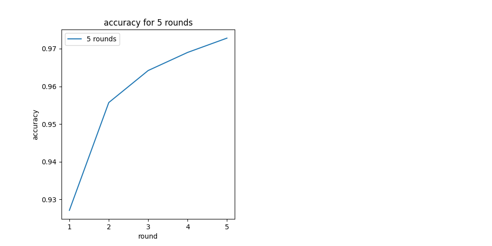
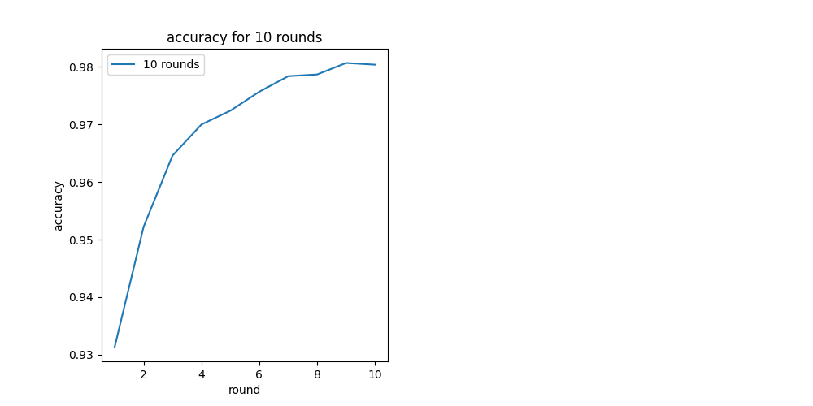
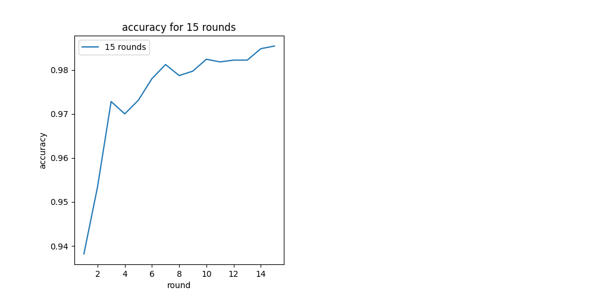
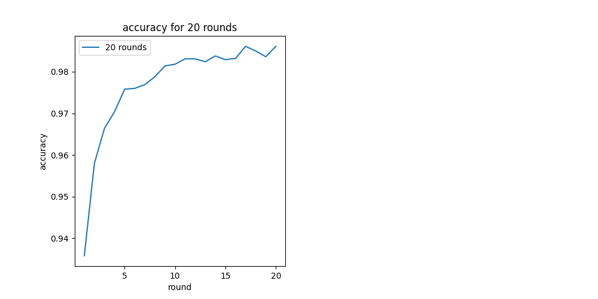
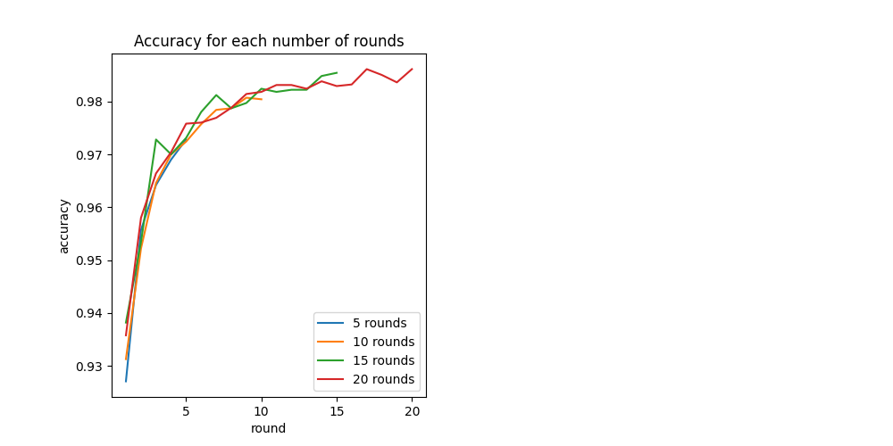
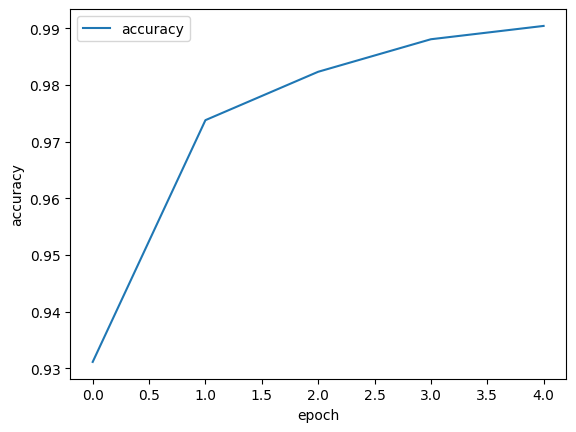
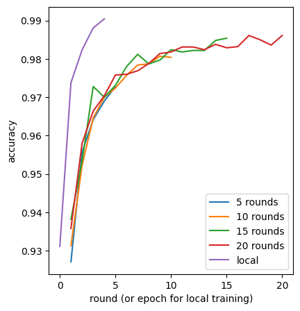

# Laboratório de Aprendizado Federado - Atividade 1

## Compilação e Execução

Dentro da pasta Lab2/Atividade1 é possível rodar o programa executando as células do arquivo atividade-1.ipynb.

As células estão separadas em grupos, sendo a primeira parte o treinamento local, como feito no roteiro, e a segunda o federado.

---

## Vídeo executando e mostrando uma análise

https://drive.google.com/file/d/1MSM-MOzKqB2odSjYPCfkN5mF4ZGKLz5H/view?usp=share_link

---

## Frameworks Utilizadas

Como instruído no roteiro, utilizamos o framework Flower para o treinamento federado. Também utilizamos o framework Ray e TensorFlow, para auxiliar o desenvolvimento do machine learning.

Os pacotes numpy e matplotlib também foram utilizados para as funções e criação de gráficos.

---

## Metodologia de implementação

O treinamento local foi feito da mesma forma que o roteiro, incluímos para a comparação com o aprendizado federado com diferentes rounds.

Em seguida, implementamos as funções necessárias para o aprendizado federado que também se encontra no roteiro, e criamos uma iteração para realizar o aprendizado com diferentes quantidades de rounds. Essas informações são salvas em um vetor

Após a realização de todos os treinamentos, as informações descobertas são salvas em um arquivo para facilitar, já que o treinamento é um processo custoso de memória e tempo.

Por fim, temos os gráficos de cada quantidade de rounds, e a comparação com todos os rounds.

---

## Célula Principal

A principal célula da atividade tem o título "Treinamento federado utilizando 10, 15 e 20 rounds".
Essa função é responsável por treinar um modelo de aprendizado federado com quatro iterações, utilizando 10 dispositivos clientes, onde cada iteração é executada em um número diferente de rodadas (5, 10, 15 e 20). O objetivo é plotar a acurácia e a perda do modelo em cada rodada para avaliar seu desempenho ao longo do tempo.
Ao final de cada iteração, a função armazena o histórico de treinamento (acurácia e perda) em uma lista de históricos, para que possam ser plotados e comparados para avaliar o desempenho do modelo em cada iteração. Isso permite que o treinamento seja monitorado ao longo do tempo e ajuda a identificar problemas ou limitações no modelo ou na estratégia de treinamento.

---

## Resultados 

**Acurácia com 5 rounds**

**Acurácia com 10 rounds**

**Acurácia com 15 rounds**

**Acurácia com 20 rounds**

**Acurácia com todos os rounds do treinamento federado**

**Acurácia do modelo local**

**Acurácia com todos os rounds do treinamento federado e o locals**

---

## Conclusão

O treinamento local, ao contrário do treinamento federado, é executado em um único dispositivo e utiliza somente os dados disponíveis nesse dispositivo. Por isso, a efetividade na acurácia é maior e com uma quantidade menor de rounds em comparação ao treinamento federado, que utiliza uma rede de dispositivos para treinar o modelo em diferentes dados distribuídos.

Com relação ao treinamento federado, é possível observar que a melhora na acurácia tende a crescer à medida que aumenta o número de rodadas. Esse comportamento ocorre devido à natureza do treinamento federado, que permite que mais dispositivos sejam incluídos na rede de treinamento e, portanto, mais dados sejam utilizados para aprimorar o modelo.

No entanto, é importante ressaltar que, em algum momento, esse ganho na acurácia se estabiliza e até mesmo começa a diminuir gradualmente. Isso ocorre porque, à medida que mais dispositivos são incluídos na rede de treinamento, há uma maior probabilidade de ocorrer uma interferência nos dados e na distribuição dos mesmos. Essa interferência pode prejudicar o treinamento e reduzir a acurácia do modelo.

Portanto, embora o treinamento federado tenha a vantagem de permitir que mais dados sejam utilizados para treinar o modelo, é preciso ter cuidado com o aumento excessivo de rodadas, pois isso pode levar à diminuição da acurácia. É importante encontrar um equilíbrio entre a quantidade de rodadas e a qualidade dos dados utilizados no treinamento para garantir que o modelo final seja eficiente e confiável.

