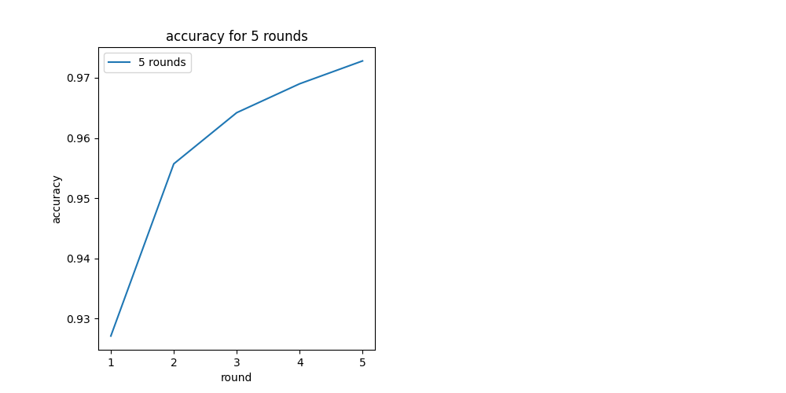
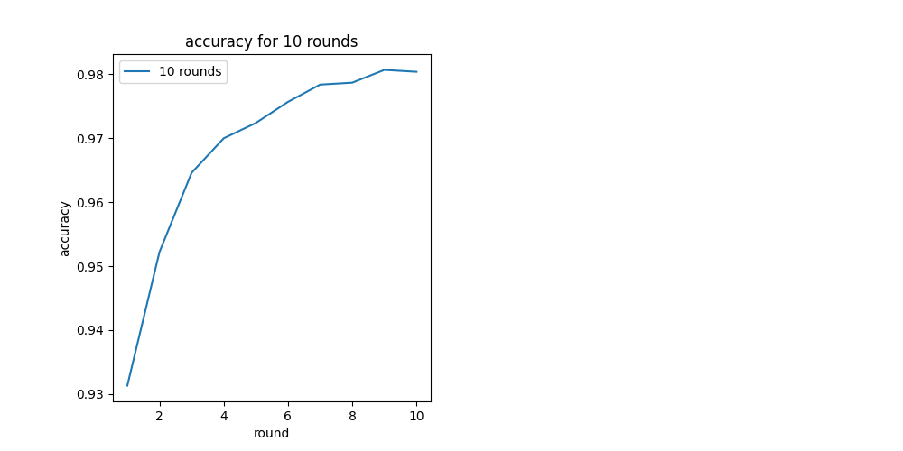
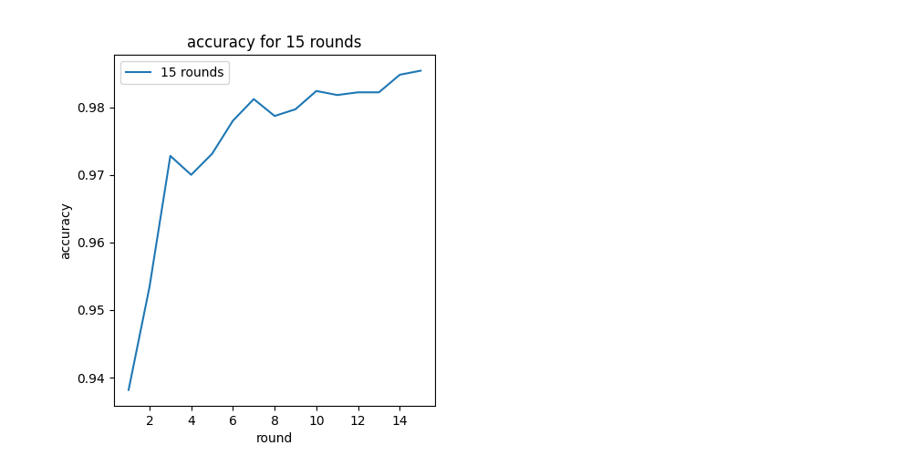
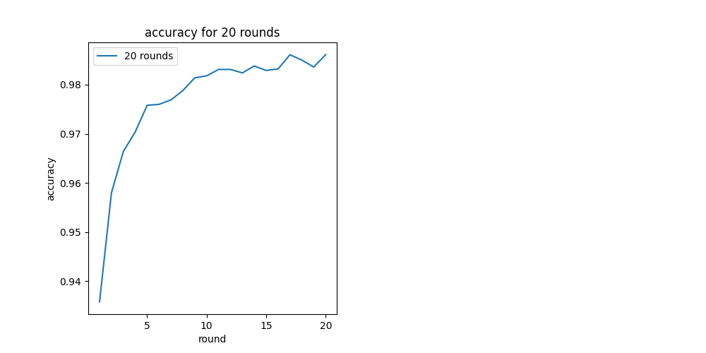
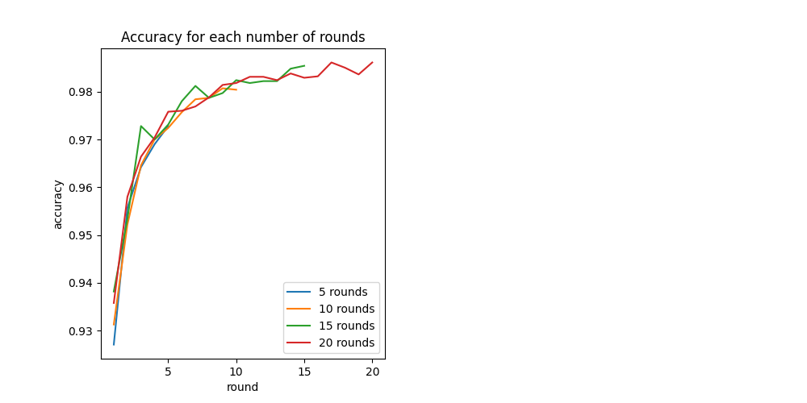

# Laboratório de Aprendizado Federado

## Atividade 1

### Compilação e Execução

Dentro da pasta Lab2, é possível rodar o programa executando as células do arquivo atividade-1.ipynb.

As células estão separadas em grupos, sendo a primeira parte o treinamento local, como feito no roteiro, e a segunda o federado.

---

### Vídeo executando e mostrando uma análise

---

### Frameworks Utilizadas

Como instruído no roteiro, utilizamos o framework Flower para o treinamento federado. Também utilizamos o framework Ray e TensorFlow, para auxiliar o desenvolvimento do machine learning.

Os pacotes numpy e matplotlib também foram utilizados para as funções e criação de gráficos.

---

### Metodologia de implementação

O treinamento local foi feito da mesma forma que o roteiro, incluímos para a comparação com o aprendizado federado com diferentes rounds.

Em seguida, implementamos as funções necessárias para o aprendizado federado que também se encontra no roteiro, e criamos uma iteração para realizar o aprendizado com diferentes quantidades de rounds. Essas informações são salvas em um vetor

Após a realização de todos os treinamentos, as informações descobertas são salvas em um arquivo para facilitar, já que o treinamento é um processo custoso de memória e tempo.

Por fim, temos os gráficos de cada quantidade de rounds, e a comparação com todos os rounds.

---

### Célula Principal

A célula 11 é a principal da atividade, onde iteramos por um array com as quantidades de rounds desejados. Após a simulação com a quantidade de rounds da iteração, as informações são salvas no array histories, para fazer a visualização com gráficos.
---

### Resultados 

---

### Conclusão

Com a visualização dos gráficos com o valor da acurácia de cada aprendizado, percebemos que quanto mais rounds, melhor é o treinamento.

# ATENÇÃO - sobre o treinamento local n sei ainda

---

## Atividade 2
