# Trabalho T1 – Implementação de Aprendizado Federado

## Instruções para execução do código 

Primeiro, é necessário criar os dados de treino e teste executando o script dentro de scritps/divisor_dataset.py

Agora, execute o server.py. Em outros terminais, execute os clientes no formato: "python3 cliente.py X", onde X é o numero do cliente, que sera usado para escolher o dataset

Por padrão, o server precisa que no mínimo 3 clientes estejam conectados para começar a treinar o modelo. Para alterar esse valor, basta alterar a variável MIN_CLIENTS dentro de server.py. O server irá escolher aleatoriamente os clientes que irão participar do treinamento, sendo que o número de clientes escolhidos é igual a NUM_CLIENTS.

O server irá treinar o modelo usando os clientes escolhidos e irá enviar o modelo para os clientes. Os clientes irão calcular a acurácia do modelo usando os dados de teste e irão enviar essa acurácia para o server. O server irá calcular a média das acurácias e irá enviar o modelo para os clientes novamente. Esse processo se repete até que o modelo tenha uma acurácia maior que TARGET_ACCURACY ou até que o número máximo de iterações (MAX_ROUNDS) seja atingido.

Ao final da execução, o server irá salvar o modelo treinado em um arquivo .h5 e gerar um arquivo .csv com os dados de cada rodada.

Para visualizar os resultados, execute o script plot_graficos.py. Esse script irá gerar os gráficos de acurácia e perda do modelo ao longo das rodadas e irá salvar esses gráficos em arquivos .png. Para especificar qual historico, mude o nome da variavel do diretorio no codigo para o nome da pasta com os csvs dos historicos desejados.

O script ira gerar um grafico de acuracia e para cada cliente, um comparando todos os clientes, e um com a acurácia para o modelo global. 

## Vídeo executando e mostrando uma análise

---

## Metodologia de implementação

Para desenvolvermos o trabalho da implementação do aprendizado federado, precisariamos de um servidor, um cliente, e uma forma de separar os dados, para enfim coletar e analisar os resultados. Então, para começar a implementação, criamos o script divisor_dataset.py, que se encontra na pasta scripts. Quando ele é executado, os dados do MNIST são baixados, embaralhados, normalizados e separados em 5 conjuntos de treino e teste. Essas informações ficam armazenadas nas pastas treino e teste, que são criadas pelo próprio script.

Com os dados prontos, podemos seguir para a implementação do servidor e cliente.

### Servidor.py

Como a especificação descreve, o nosso servidor tem um número mínimo de clientes, um número máximo de rounds e uma acurácia desejada. Temos também o número de clientes que o servidor escolherá, caso tenha mais clientes que o mínimo, e um timeout definido, para não ficar esperando uma conexão com o cliente por muito tempo.

Em seguida, ele tem as informações necessárias salvas, como todos os clientes, qual o round atual do treinamento, e as informações coletadas com os treinos.

Após a criação da forma que o servidor irá armazenar os dados, ele cria uma classe para implementar o serviço de aprendizado federado definido no protobuf, permitindo o registro de clientes.

Também são implementadas as funções para escolher os clientes aleatoriamente, caso o número disponível seja maior que o desejado.

Por fim, chegamos nas funções do servidor para fazer com que o aprendizado federado em diferentes clientes ocorra. Criamos um método para calcular a média federada, um para treinar os clientes, um pra avaliar a thread dos clientes, um para testar o modelo global, e outra para treinar os clientes em threads, pois cada cliente está em uma thread separada das outras.

### Cliente.py

O nosso cliente do aprendizado federado tem as informações de ID, IP e a porta do servidor que vai se conectar. Para que ele execute o treinamento, utiliza do seu ID para escolher o arquivo de treino a ser utilizado, da forma 'treino/x_train_{CLIENT_ID}.npy'.

No treinamento, ele transforma os pesos em um array de floats, tranformando o shape do vetor para uma unica dimensão. Quando o treino é finalizado, ele retorna uma resposta com os pesos do modelo local e o número de amostras como uma lista de Weight messages.

Em seguida, quando o servidor enviar as métricas aos clientes, eles são responsáveis por avaliar e descobrir a acurácia obtida por eles.

---

## Resultados 

Temos dois exemplos para mostrar os resultados, o clients_history_1 e clients_history_2.

Nesse treinamento, utilizamos quatro clientes, a seguir estarão os gráficos da acurácia de cada cliente de acordo com os rounds:

Cliente 1:

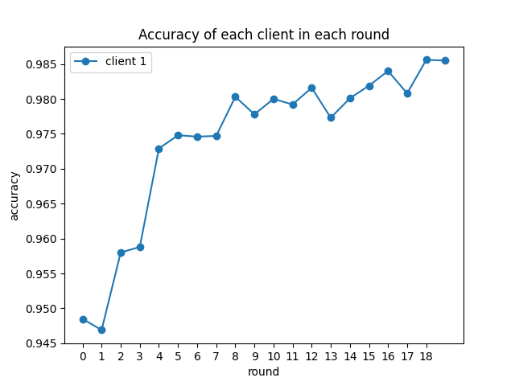

Cliente 2:

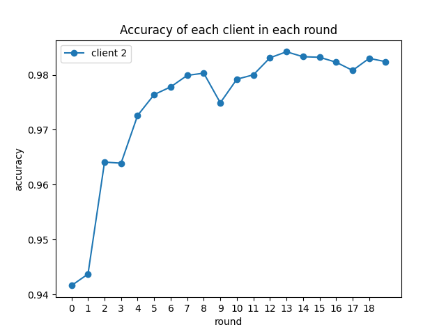

Cliente 3:

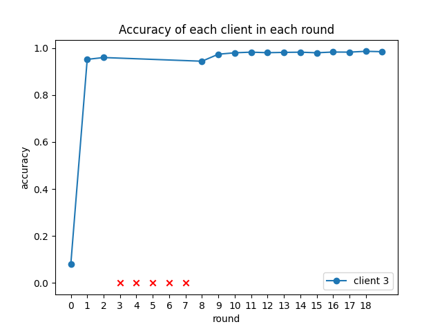

Nesse cliente 3, removemos ele de 5 rounds, para mostrar que é possível tirar um cliente e inserí-lo novamente.

Cliente 4:

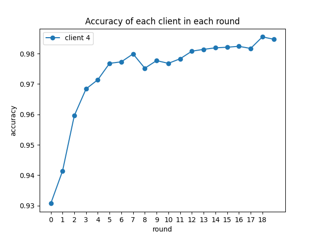

Como podemos ver em todos os gráficos, a acurácia vai aumentando com a iteração dos rounds, porém não necessariamente com todos os rounds tendo mais acurácia que o anterior. Como podemos ver, por exemplo, no cliente 1, em diversos pontos a acurácia diminui para aumentar novamente, mas no geral ela está muito maior que nos primeiros rounds.

Modelo Global:

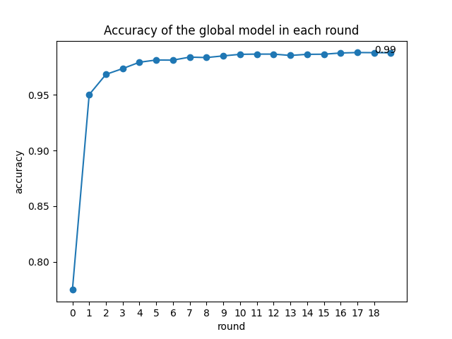

Aqui, podemos ver a acurácia do modelo global crescendo rapidamente, porém a partir do round 7, a acurácia não tem um aumento significativo, se tornando um valor repetitivo com vários rounds.

Acurácia de todos os clientes:

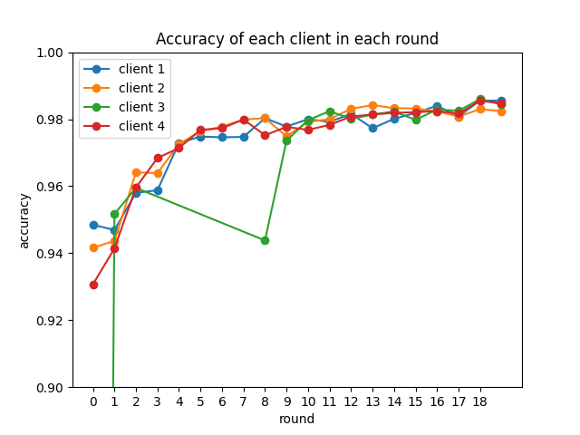

Na comparação de acurácia entre os clientes, podemos analisar que eles vão tendo resultados parecidos com o avanço dos rounds, sem muita diferença entre as acurácias, com exceção do cliente 3, que foi removido dos treinamentos por alguns rounds. Porem, podemos ver que removê-lo faz diferença apenas caso ele não volte aos treinamentos, mas mesmo com rounds a menos, ele chegou nas mesmas acurácias que os outros clientes.

Em seguida, fizemos o mesmo teste com 5 clientes, e os resultados podem ser vistos a seguir:

Cliente 1:

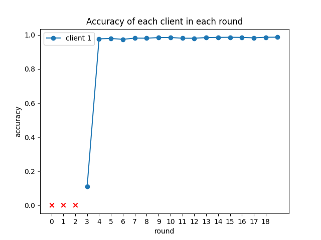

No cliente 1, testamos conecta-lo apenas no round 3, para avaliar se o momento que ele começa o treinamento afeta a acurácia, porém podemos ver que não houve diferença, e ele rapidamente estava com uma ótima acurácia. Isso acontece porque o cliente que se conecta recebe os pesos globais que é a media federada dos pesos que foram treinados por outros clientes, assim, um novo cliente já começa com um modelo bem treinado. 

Cliente 2:

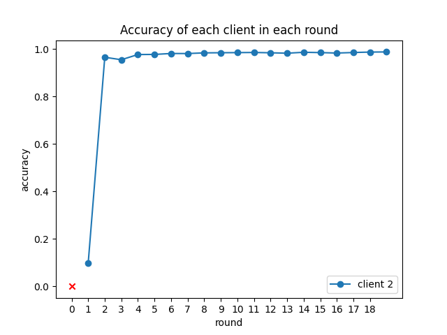

Cliente 3:

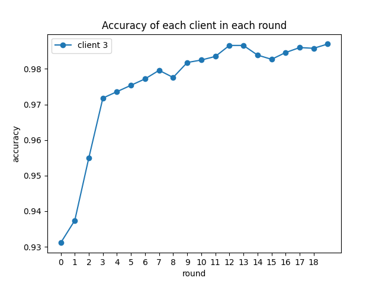

Cliente 4:

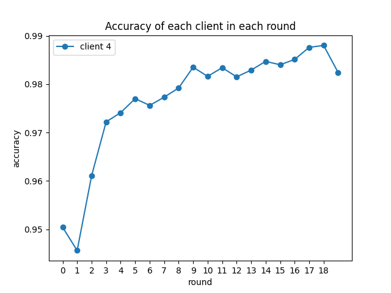

Cliente 5:

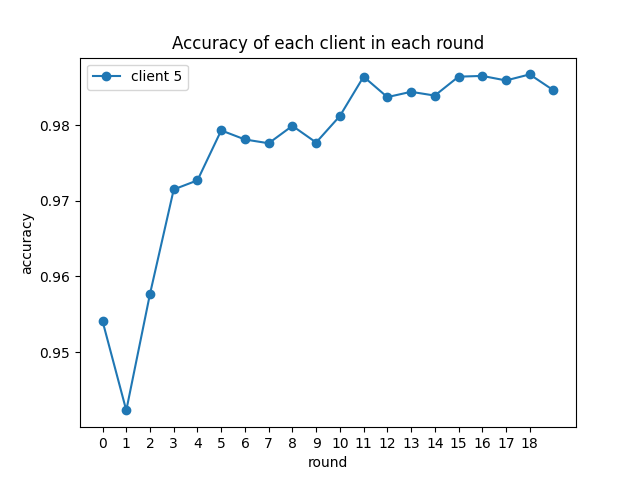

T:odos os clientes:

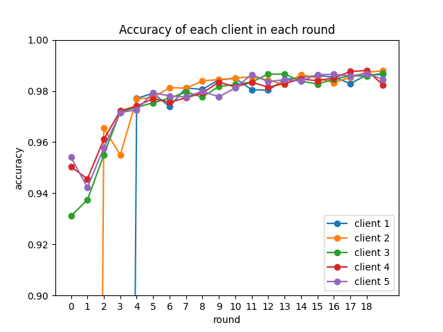

Neste último gráfico, podemos então ter certeza que, para uma grande quantidade de rounds, não importa se um cliente começa o treinamento após outros, que rapidamente ele chegará na acurácia parecida aos outros clientes. 

---

## Conclusão

Por fim, podemos concluir que, a acurácia em algum momento se estagnará, e não terá um avanço grande mesmo com uma quantidade grande de rounds, tornando o treinamento por muitos rounds desnecessário. Também conseguimos ver pelos gráficos, que remover um cliente, ou fazer ele iniciar tardiamente não afeta seu resultado, com ele chegando nos mesmos resultados ou superiores que os outros clientes.

Portanto, o treinamento federado funcionou como o esperado, ótimo para obter as acurácias, com os valores chegando muito perto de 0.99, que era nosso target accuracy. 
