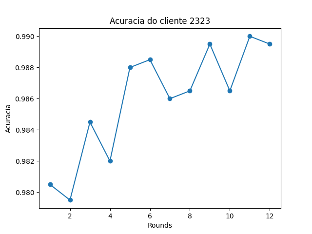
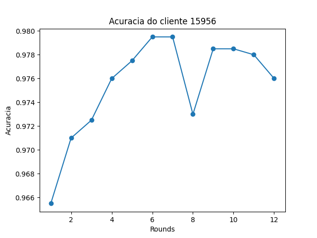
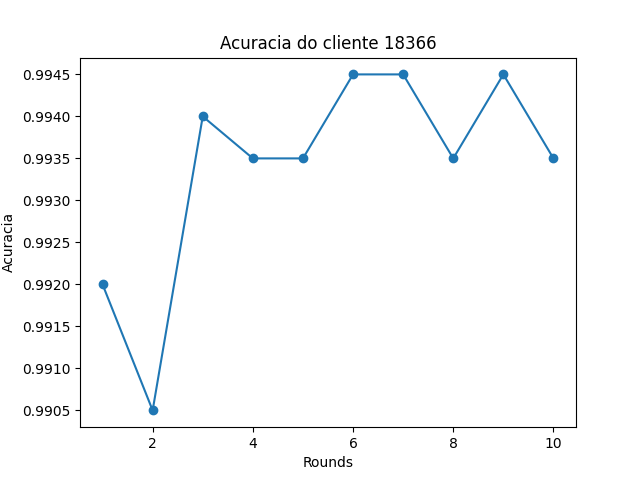
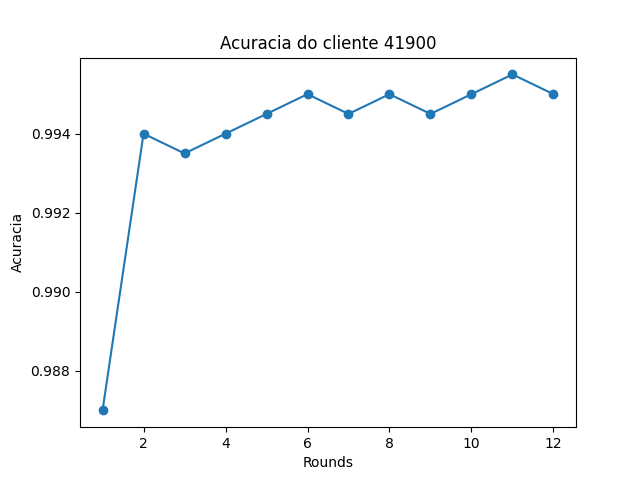

# Trabalho T2 – Implementação de Aprendizado Federado Serveless com MQTT

## Instruções para execução do código 

Requisitos: Docker e Docker Compose 

Para preparar os dados para o treinnamento, basta executar o código, dentro da pasta scripts: 
    
    ```bash 
    python3 divisior_datasets.py
    ```


Para executar o código, basta rodar o shell script up.sh, que irá criar o container do do MQTT e, em seguida, o código do trabalho.

```bash
./up.sh
```


Para gerar os gráficos (o OS não permitiu gráficos serem gerados pelo matplolib sem estar sendo executado na thread principal), basta executar: 
    
    ```bash
    python3 gerar_graficos.py
    ```


## Vídeo executando e mostrando uma análise

[https://youtu.be/5E5stN3CJ54](https://youtu.be/VJ08hQ-tnag](https://youtu.be/VJ08hQ-tnag)

---

## Metodologia de implementação

A aplicação foi desenvolvida utilizando um servidor MQTT para o controle da fila de mensagens. Nessa abordagem, cada cliente é representado por um processo distinto e atua como um peer dentro da rede. O servidor MQTT desempenha o papel de receber as mensagens provenientes dos clientes e distribuí-las para os demais clientes. Esses clientes, por sua vez, processam as mensagens recebidas e enviam as respostas correspondentes de volta para o servidor.

A funcionalidade do código se baseia na sincronização dos estados dos clientes por meio da utilização de publicações em filas. Essa sincronização é essencial para garantir que todos os clientes possuam informações atualizadas sobre o estado da rede e possam agir de acordo com essas informações. Dessa forma, as publicações em filas desempenham um papel fundamental na troca de dados entre os clientes e no estabelecimento de uma comunicação eficiente e coordenada.

### clienteMqtt.py

O cliente MQTT é responsável por se conectar ao servidor MQTT e publicar as mensagens nas filas. Ele também é responsável por se inscrever nas filas para receber as mensagens de outros clientes. Além disso, ele desempenha um papel importante no controle da eleição dentro do sistema. Através dessa funcionalidade, ele permite a seleção dos treinadores e do controlador, que são responsáveis por coordenar as atividades e tomar decisões cruciais na aplicação.

O processo de eleição ocorre através da troca de mensagens entre os clientes MQTT. Cada cliente pode enviar uma mensagem indicando sua disponibilidade para assumir o papel de treinador ou controlador. Essas mensagens são publicadas nas filas e, em seguida, todos os clientes têm a oportunidade de receber essas mensagens e avaliar a disponibilidade e as capacidades de cada um.

Dessa forma, o MQTT oferece uma arquitetura de simples implementação para o controle da fila de mensagens e a sincronização dos estados dos clientes, além de fornecer mecanismos eficientes para a eleição de treinadores e controladores, permitindo uma comunicação eficiente e coordenada dentro do sistema.

### treinador.py

O treinador implementa um cliente MQTT que atua como um treinador em um sistema de treinamento distribuído. A aplicação utiliza a biblioteca paho.mqtt.client para se conectar a um servidor MQTT e interagir com as filas de mensagens.

A classe principal do código é chamada de Treinador. Ela contém métodos para se inscrever em filas específicas, publicar mensagens, avaliar o desempenho do treinador e lidar com eventos de início e parada do treinamento. No método on_start_training, o treinador é notificado pelo controlador para iniciar o treinamento. O treinador carrega o conjunto de dados correspondente ao número atribuído a ele e realiza uma etapa de treinamento do modelo global. Em seguida, calcula a acurácia do modelo local e envia seus pesos atualizados para o controlador através da fila sd/solution. O método on_stop_training é chamado quando o treinamento é finalizado. O treinador calcula novamente a acurácia final, a armazena e a envia para o controlador. Em seguida, ele salva as acurácias obtidas em um arquivo CSV e finaliza sua conexão com o servidor MQTT.

### controlador.py

O controlador é responsável por receber as atualizações dos treinadores, e então, atualizar o modelo global, que é a média federada dos pesos dos modelos treinados pelos treinadores. Ele também é responsável por enviar os pesos do modelo global para os treinadores, para que eles possam treinar com os pesos atualizados.

Ao final da meta de acurácia, o controlador envia uma mensagem para os treinadores, para que eles parem de treinar e enviem a acurácia final do modelo treinado. Isso também ocorre se o número de rounds for atingido, ou se o controlador receber uma mensagem de parada de treinamento de um dos treinadores.

Essa abordagem de treinamento distribuído permite que cada treinador contribua para o aprimoramento do modelo global enquanto treina com seus próprios dados locais. O controlador coordena as operações de treinamento, sincronização e comunicação entre os treinadores, garantindo que o modelo global seja atualizado e os treinadores sejam notificados sobre quando parar o treinamento e enviar suas acurácias finais.

---

## Resultados 

Temos dois exemplos para mostrar os resultados, o clients_history_1 e clients_history_2.

Nesse treinamento, utilizamos quatro clientes, a seguir estarão os gráficos da acurácia de cada cliente de acordo com os rounds:

Cliente 1:



Cliente 2:



Cliente 3:




Cliente 4:




---

## Conclusão

Por fim, ao analisar os resultados do sistema de treinamento distribuído, é possível observar que os modelos individuais evoluem de forma semelhante, embora treinem com conjuntos de dados diferentes. A agregação dos pesos dos modelos individuais no modelo global permite que este último generalize melhor, uma vez que cada treinador aprende características específicas dos dados com os quais foi treinado.

Essa abordagem de treinamento distribuído, em que cada treinador utiliza um conjunto de dados único, oferece uma vantagem significativa em termos de diversidade de treinamento. Cada treinador explora e aprende padrões distintos em seus próprios conjuntos de dados, enriquecendo assim o conhecimento compartilhado pelo modelo global.

Através da colaboração entre treinadores e da troca contínua de informações entre eles e o controlador, o sistema é capaz de aproveitar as vantagens da descentralização do treinamento, resultando em um modelo global mais robusto e geral.

Em suma, esse sistema de treinamento distribuído baseado em MQTT demonstra a capacidade de obter melhorias no desempenho e na generalização dos modelos, ao combinar o conhecimento individual de cada treinador em um modelo global agregado.

---
