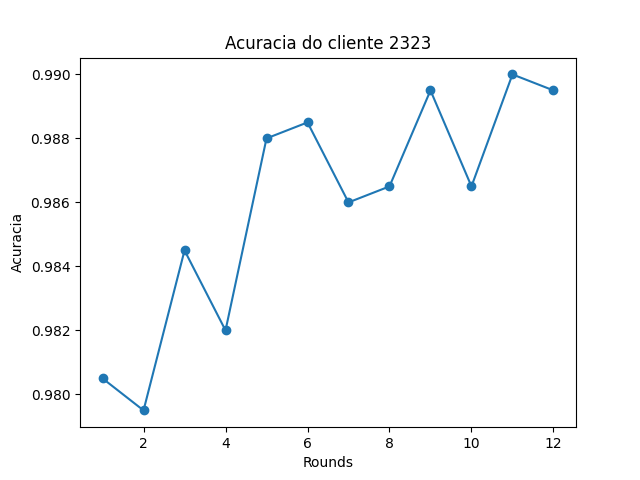
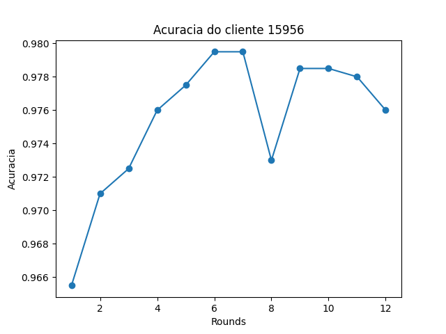
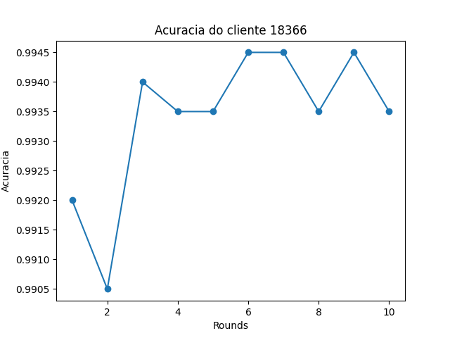
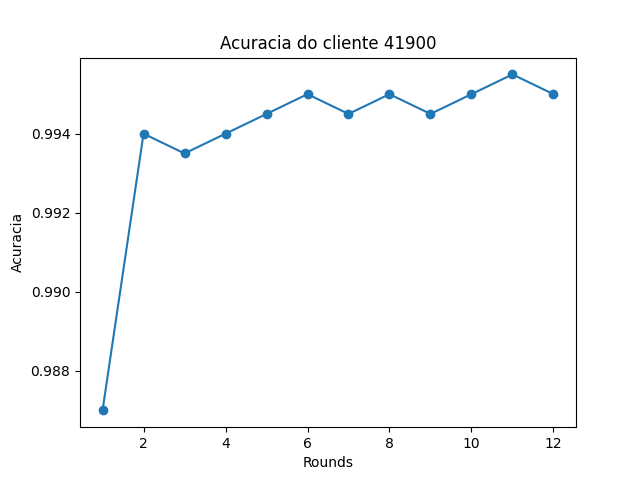

# Trabalho T1 – Implementação de Aprendizado Federado

## Instruções para execução do código 

Requisitos: Docker e Docker Compose 

Para preparar os dados para o treinnamento, basta executar o código, dentro da pasta scripts: 
    
    ```bash 
    python3 divisior_datasets.py
    ```


Para executar o código, basta rodar o shell script up.sh, que irá criar o container do do MQTT e, em seguida, o código do trabalho.

```bash
./up.sh
```


Para gerar os gráficos (o OS não permitiu gráficos serem gerados pelo matplolib sem estar sendo executado na thread principal), basta executar: 
    
    ```bash
    python3 gerar_graficos.py
    ```


## Vídeo executando e mostrando uma análise

https://youtu.be/5E5stN3CJ54

---

## Metodologia de implementação

A aplicação foi desenvolida utilizando um servidor MQTT para o controle da fila de mensagens, onde cada cliente, representado por um diferente processo, atua como um peer da rede. O servidor MQTT é responsável por receber as mensagens dos clientes e distribuir para os outros clientes, que irão processar as mensagens e enviar as respostas para o servidor.

O código funciona através da sincronização dos estados dos clientes por meio de publicações em filas. 

### clienteMqtt.py
O cliente MQTT é responsável por se conectar ao servidor MQTT e publicar as mensagens nas filas. Ele também é responsável por se inscrever nas filas para receber as mensagens de outros clientes.

Além disso, ele atua no controle da eleição, para, assim, definir quais serão os treinadores e qual será o controlador. 


### treinador.py

O treinador recebe a ordem do controlador para começar o treinamento, e então ele começa a treinar o modelo, enviando as atualizações para o controlador. Enviando, por MQTT, os pesos do modelo e a acurácia do modelo treinado. 


### controlador.py

O controlador é responsável por receber as atualizações dos treinadores, e então, atualizar o modelo global, que é a média federada dos pesos dos modelos treinados pelos treinadores. Ele também é responsável por enviar os pesos do modelo global para os treinadores, para que eles possam treinar com os pesos atualizados.

Ao final da meta de acurácia, o controlador envia uma mensagem para os treinadores, para que eles parem de treinar e enviem a acurácia final do modelo treinado. Isso também ocorre se o número de rounds for atingido, ou se o controlador receber uma mensagem de parada de treinamento de um dos treinadores.

---

## Resultados 

Temos dois exemplos para mostrar os resultados, o clients_history_1 e clients_history_2.

Nesse treinamento, utilizamos quatro clientes, a seguir estarão os gráficos da acurácia de cada cliente de acordo com os rounds:

Cliente 1:



Cliente 2:



Cliente 3:




Cliente 4:




Foi dado um limite de 
---

## Conclusão

Por fim, analisando os resultados, nota-se que, sim, os modelos evoluem um de forma semelhante, onde cada um treina utilizando um dataset diferente, logo quando seus pesos são agregados, o modelo global é capaz de generalizar melhor, pois cada modelo irá aprender características diferentes dos dados.

---